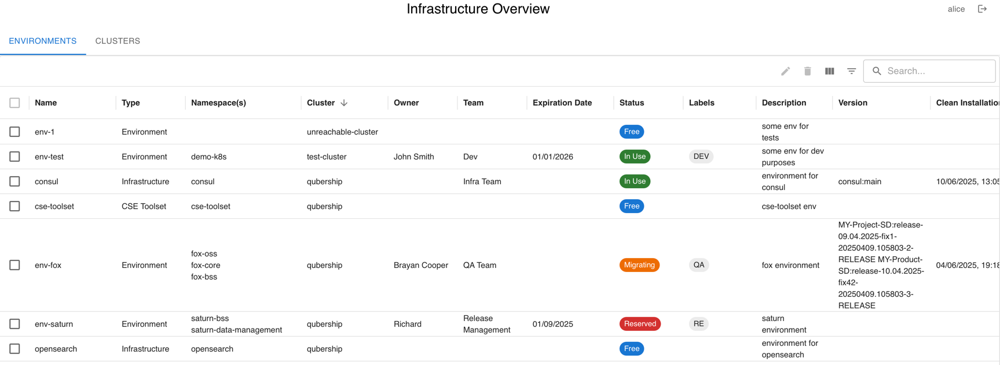
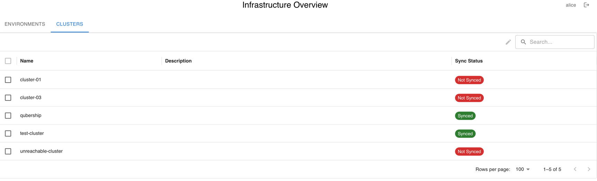

[](https://sonarcloud.io/summary/new_code?id=Netcracker_qubership-colly)
[](https://sonarcloud.io/summary/new_code?id=Netcracker_qubership-colly)

# Qubership Colly

A modern cluster environment tracking tool. Qubership Colly provides comprehensive visibility into Kubernetes environments across multiple clusters, helping teams track resource usage, manage environment lifecycles, and monitor common environment metrics.

## Features

- **Multi-cluster Support** - Monitor environments across multiple Kubernetes clusters
- **Cloud Passport Integration** - Native support for Cloud Passport configuration management
- **Environment Grouping** - Group multiple namespaces into logical environments
- **Environment Lifecycle Management** - Track environment creation, expiration, and cleanup
- **Rich Metadata Management** - Track owners, teams, descriptions, and custom labels for Environments
- **Deployment Version Tracking** - Monitor version information across environments
- **Monitoring Integration** - Collect and display metrics from Prometheus/monitoring systems
- **OIDC Authentication** - Secure access with Keycloak or other OIDC providers
- **Automated Discovery** - Scheduled synchronization with cluster resources
- Advanced filtering and search capabilities

## User Interface

### Environment Table

The main interface displays environments in a comprehensive table with the following columns:

- **Name** - Environment name from Cloud Passport configuration
- **Type** - Environment type (ENVIRONMENT, CSE_TOOLSET, DESIGN_TIME, APP_DEPLOYER, INFRASTRUCTURE, PORTAL, UNDEFINED) - editable by admins
- **Namespace(s)** - Associated Kubernetes namespaces (color-coded: red if namespace doesn't exist in K8s)
- **Region** - Geographic region or deployment region for the environment (from project configuration)
- **Cluster** - Source cluster name
- **Owner(s)** - List of environment owners (editable by admins)
- **Team(s)** - List of associated teams (editable by admins)
- **Expiration Date** - Environment expiration date for lifecycle management (editable by admins)
- **Status** - Current status (IN_USE, FREE, MIGRATING, RESERVED) with color coding (editable by admins)
- **Labels** - Custom labels displayed as chips (editable by admins)
- **Description** - Environment description from Cloud Passport or manual entry (editable by admins)
- **Version** - Deployment version information from config maps
- **Clean Installation Date** - Last clean installation timestamp from config maps
- **Monitoring Columns** - Dynamic columns for custom monitoring metrics (e.g., Running Pods, Failed Deployments)

### Cluster Table


- View cluster synchronization status
- Monitor cluster connectivity
- Track cluster-specific configurations

### Administrative Features
- Edit environment metadata (type, owner, team, description, status, labels, expiration)
- Edit cluster metadata (description)
- Delete environments with confirmation

## Architecture Overview

Qubership Colly uses a microservices architecture with three main services:

```
┌─────────────┐
│   Browser   │
└──────┬──────┘
       │
       v
┌─────────────────┐
│   ui-service    │ (Port 3000)
│   - Serves UI   │
│   - BFF pattern │
│   - Aggregates  │
│     data        │
└────┬────┬───────┘
     │    │
     │    └──────────────────┐
     v                       v
┌──────────────┐    ┌────────────────────┐
│ inventory-   │    │ operational-       │
│ service      │    │ service            │
│ (Port 8081)  │    │ (Port 8080)        │
└──────────────┘    └────────────────────┘
```

### Services:
- **ui-service** (Port 3000): React-based web interface that acts as a Backend for Frontend (BFF), aggregating data from both backend services
- **inventory-service** (Port 8081): Manages environment inventory, metadata, and cluster information from Git repositories
- **operational-service** (Port 8080): Handles operational data, Kubernetes synchronization, and monitoring metrics
- **Redis**: Caching layer for improved performance
- **Keycloak**: OIDC authentication provider
- **PostgreSQL**: Database for keycloak only


Key Points:
- **Separation of Concerns**: Each service has a single, well-defined responsibility
- **BFF Pattern**: UI service aggregates data from multiple backend services
- **Scheduler**: Configurable cron jobs for cluster synchronization in operational-service
- **Authentication**: OIDC integration for secure access control


## Quick Start

### Run with Docker Compose

The easiest way to run all services together using Docker Compose profiles:

```bash
# Start infrastructure services (PostgreSQL, Redis, Keycloak)
docker-compose --profile infra up -d

# Start application services (inventory, operational, ui)
docker-compose --profile apps up --build -d

# Or start everything at once
docker-compose --profile infra --profile apps up --build -d

# Convenient script to start all services
./docker-start.sh
```

This will start:
- **UI Service**: http://localhost:3000
- **Inventory Service**: http://localhost:8081
- **Operational Service**: http://localhost:8080
- **Keycloak**: http://localhost:8180 (admin/admin, realm: quarkus)
- PostgreSQL (port 5432) and Redis (port 6379) backends

### Build Images Manually

```bash
# Build all Docker images
./build-images.sh
```

### Deploy with Helm
```bash
# Add helm repository
helm repo add netcracker https://netcracker.github.io/helm-charts
helm repo update

# Install with basic configuration
helm install qubership-colly netcracker/qubership-colly \
  --set colly.db.password=<DB_PASSWORD> \
  --set colly.db.username=<DB_USERNAME> \
  --set colly.db.host=<DB_HOST> \
  --set colly.idp.url=http://<KEYCLOAK_HOST>:<PORT>/realms/colly-realm
```

## Authentication and Security

Qubership Colly uses **OIDC/OAuth2 authentication** via Keycloak for secure access control across all services.

### Keycloak Setup

The project includes automated setup scripts for configuring Keycloak clients:

```bash
# Setup all Keycloak clients automatically
./setup-keycloak-clients.sh

# With custom Keycloak URL
./setup-keycloak-clients.sh http://keycloak:8180 quarkus
```

### Authentication Flow

- **ui-service**: Hybrid mode - handles user login via browser and propagates tokens
- **inventory-service**: Service mode - validates Bearer tokens from users and services
- **operational-service**: Service mode with service accounts - uses client credentials for scheduled tasks

## Configuration

For detailed configuration options including application properties, environment variables, Helm chart parameters, and deployment examples, see [docs/CONFIGURATION.md](docs/CONFIGURATION.md).

### Project Git Repository

Qubership Colly uses a Project Git Repository to manage project configurations, instance repositories, and deployment pipelines. Each project is defined by a `parameters.yaml` file containing:

- Project metadata (customer name, project type, cluster platform)
- Instance repositories with Cloud Passport configurations
- CI/CD pipeline definitions (cluster provision, environment provision, solution deploy)
- EnvGene template repositories with artifact configurations

For complete documentation on project structure, field descriptions, and configuration examples, see [docs/PROJECT_CONFIGURATION.md](docs/PROJECT_CONFIGURATION.md).

## Development

### Prerequisites
- Java 21+
- Node.js 18+
- PostgreSQL 12+
- Docker and Docker Compose

### Project Structure
```
qubership-colly-v2/
├── envgene-inventory-service/   # Inventory management service
├── environment-operational-service/  # Operational data service
├── ui-service/                  # UI and BFF service
├── docker-compose.yml           # Docker Compose configuration
└── build-images.sh              # Build script for all services
```

### Build and Run Services

#### Option 1: Using Docker Compose (Recommended)
```bash
# Start all services with dependencies
./docker-start.sh
```

#### Option 2: Run Services Individually in Dev Mode

**Terminal 1 - Inventory Service:**
```bash
cd envgene-inventory-service
./mvnw quarkus:dev -Dquarkus.http.port=8081
```

**Terminal 2 - Operational Service:**
```bash
cd environment-operational-service
./mvnw quarkus:dev -Dquarkus.http.port=8080
```

**Terminal 3 - UI Service:**
```bash
cd ui-service
./mvnw quarkus:dev -Dquarkus.http.port=3000
```

**Terminal 4 - Frontend Development Server (optional):**
```bash
cd ui-service/src/main/webui
npm install
npm start  # Runs on port 3001 with proxy to backend
```

**Note:** For OIDC authentication in dev mode, ensure Keycloak is running:
```bash
# Start Keycloak and dependencies
docker-compose --profile infra up -d

# Setup Keycloak clients
./setup-keycloak-clients.sh
```

### Testing
```bash
# Test all services
cd envgene-inventory-service && mvn test
cd environment-operational-service && mvn test
cd ui-service && mvn test

# Run with coverage
mvn test jacoco:report
```

## Contributing

1. Fork the repository
2. Create a feature branch
3. Make your changes
4. Add tests for new functionality
5. Submit a pull request

## License

This project is licensed under the Apache License 2.0 - see the LICENSE file for details.

## Support

For issues and questions:
- Create an issue in the GitHub repository
- Check the [Configuration Guide](docs/CONFIGURATION.md) for detailed setup instructions
- Review troubleshooting steps in the configuration documentation
